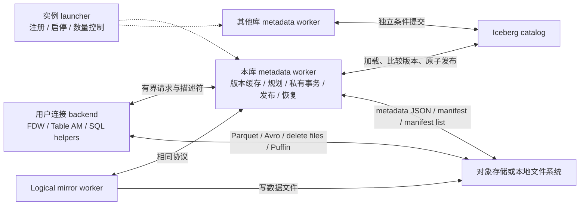
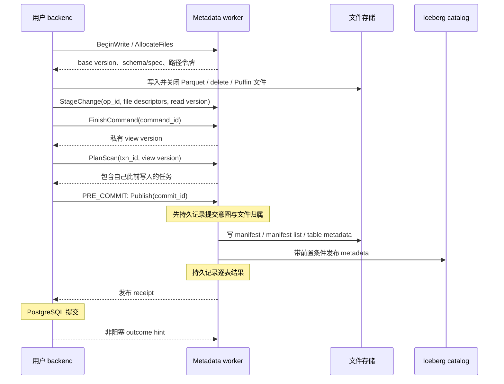

<!--
Licensed under the Apache License, Version 2.0 (the "License");
you may not use this file except in compliance with the License.
You may obtain a copy of the License at

    http://www.apache.org/licenses/LICENSE-2.0

Unless required by applicable law or agreed to in writing, software
distributed under the License is distributed on an "AS IS" BASIS,
WITHOUT WARRANTIES OR CONDITIONS OF ANY KIND, either express or implied.
See the License for the specific language governing permissions and
limitations under the License.
-->

# 常驻 Iceberg 元数据 backend：架构设计

状态：架构提案。第 1 阶段已实现 launcher、每库 worker 和 ping/echo 通道，
配置及实现范围见 [metadata workers](../metadata-workers.md)。本文的缓存、规划、事务迁移
等后续阶段尚未实现；设计时的代码基线为 `4e60434`，iceberg-cpp 0.4.0。
本轮采用**每个启用 pgiceberg 的 database 一个常驻元数据 worker，实例级一个 launcher**。
允许其他 database 和 Spark/Flink 等引擎并发访问同一张 Iceberg 表。
以下是建议采用的实现契约，不代表这些能力已经存在。写事务的状态机、异常时序和
持久化规则见 [元数据事务协议](metadata-transactions.md)，两篇文档配套阅读。
部署选择的源码依据与反例见 [core 和知名扩展对照](metadata-worker-placement.md)。
每库部署是针对本项目现有状态归属的选择，并非 PostgreSQL 强制要求。

建议集中 Iceberg 元数据访问、扫描规划、事务暂存和发布，数据文件的读取与写入仍由
用户连接的 backend 执行。每个库的所有业务入口都经过该库的元数据服务，包括 FDW、Table AM、
logical mirror 和 SQL 管理函数。后续可以加入共享数据缓存，但不让每次数据读取
必须经过唯一的元数据进程。

这里的“元数据操作”指 Iceberg catalog、table metadata JSON、snapshot、manifest、
schema/spec、table properties 和维护操作。PostgreSQL 的 `pg_class`、`pg_attribute`、
本地 catalog 配置、ACL 和绑定关系仍由连接 backend 在自己的 PostgreSQL 事务中处理。
Parquet footer、文件统计和 Puffin 内容由文件写入者生成，再作为提交材料交给服务；
这些材料本身不等于一次 Iceberg 元数据发布。

## 1. 当前代码给出的拆分边界

| 路径 | 当前行为 | 重构后的归属 |
| --- | --- | --- |
| `common/catalog.cc` | 每次加载创建 catalog、加载 Iceberg Table | 服务管理 catalog 客户端与版本缓存；连接端保留 PG 配置解析 |
| `fdw/fdw.cc::PgIcebergGetForeignRelSizeImpl` | 规划期加载表、读取 snapshot summary | 通过服务取得估算与 schema 描述 |
| `engine/iceberg_scan.cc::Init` | `NewScan`、`PlanFiles`、创建 reader 在同一进程 | 规划移到服务，reader 留在连接端 |
| `engine/iceberg_scan.cc::OpenCurrentTask` | `FileScanTaskReader` 输出 `ArrowArrayStream` | 留在连接端，复用现有读取能力 |
| `engine/scan_state.cc::IterateScan` | Arrow batch 逐行转 `Datum`、填充 slot | 留在连接端 |
| `engine/modify_state.cc` 的 `Pending*Change` | 文件写完后，把改动应用到本地 Iceberg Transaction | 文件写入留在连接端，逻辑改动和 Transaction 移到服务 |
| `StaticTableForPendingChange` | 用私有 transaction metadata 实现读己之写 | 服务按事务维护私有读视图 |
| `CommitPendingModifyChanges` | 在 PG `PRE_COMMIT` 顺序发布各表 | 同步请求服务发布；PG 事务仍归原连接 |
| `engine/commit_recovery.cc` | 连接进程写恢复日志、检查和回滚 | 服务拥有提交日志和 Iceberg 恢复操作 |
| `functions/`、Table AM DDL hooks | 存在独立的 create/register/drop/schema update 入口 | 全部转成服务请求，不能留下旁路 |
| `logical/logical.cc` | 写文件、提前 flush Iceberg，再推进 replication slot | logical worker 成为服务客户端，保留原来的顺序 |

iceberg-cpp 已提供可独立构造的 `FileScanTask` 和 `FileScanTaskReader::Options`。
reader 接收 FileIO、schema、历史 schemas、投影、name mapping 和 reader properties，
不要求持有可更新的 catalog Table。这是把规划与读取分开的依据。

相关现有契约见 [事务与恢复](postgres-iceberg-commit.md) 和
[三个 PostgreSQL 接口的边界](postgres-extension-surfaces.md)。本文不改变三者的独立性。

## 2. 进程与对象所有权

服务进程是本 database 所有 pgiceberg 请求的唯一 Iceberg 元数据执行者。
连接端不得因服务繁忙或故障而自行
`LoadTable`、重新规划、提交或回滚 Iceberg；已有完整读计划可以继续消费，新的元数据
请求必须等待服务恢复或返回明确错误。

连接端可持有服务发来的**不可变描述副本**，例如 schema、spec 和 file task。
读取这些副本不必逐字段 RPC；它们由服务发放的版本令牌约束，不能被连接端更新成
新的 table metadata。不能把 `iceberg::Table*`、`shared_ptr` 或 C++ 容器跨进程传递。

元数据缓存只是加速层。持久真相仍是 Iceberg catalog/metadata 文件，以及记录本实例
未决提交的持久日志。不能用一个进程里的内存表取代外部 catalog 的原子提交协议。

### 每库 worker 与实例 launcher

`shared_preload_libraries` 注册静态 launcher，launcher 按显式启用列表动态注册每库
worker。建议新增 SIGHUP 配置 `pgiceberg.metadata_databases`，只为列出的库启动服务；
第一版不遍历所有库查找扩展，也不因任意用户的首次查询隐式启用服务。
launcher 仅访问共享系统目录、维护注册表，不创建 Iceberg catalog 或发布元数据。
用户 RPC 直接访问本库 worker，不由 launcher 转发。动态 worker 使用
`BGW_NEVER_RESTART`，由 launcher 根据注册状态和退避策略统一补启动；不同时启用
postmaster 自动重启和 launcher 重建两个调度来源。静态 launcher 自身仍可自动重启。

每库 worker 使用数据库 OID 初始化连接，检查扩展版本，在短 PG 事务中通过 SPI
读取已提交配置。网络 I/O 不持有这些配置查询的 PG 事务和锁。worker 使用明确配置的
服务身份；用户请求仍按调用者权限处理，不能把服务身份的权限转授给用户。
PostgreSQL worker 只能初始化一次数据库连接，不能切库；每库部署与该边界一致。
[PostgreSQL background worker 文档](https://www.postgresql.org/docs/18/bgworker.html)

第一版在 `BgWorkerStart_RecoveryFinished` 后启动，只在可写主库发布或补偿。
物理 standby 的读服务和主备切换另行定义，不能在恢复期间自动执行外部提交。

连接 backend 在自己的事务快照下解析本地配置、检查权限，再发送带身份范围的
`CatalogBinding`。这样同一事务中新建 catalog 配置后立即使用，也不会因常驻进程
看不到未提交的配置行而失败。尚未提交的配置只能进入该事务私有范围，不能污染全局缓存。

服务重启后可以自行重载本库已提交的配置。journal 保存 catalog 身份、配置指纹和
凭证来源引用，禁止落盘带密码的 URI、访问令牌或明文密钥。配置身份不符、配置已删除、
凭证过期，或配置只存在于已回滚事务中时，恢复条目进入 `WAITING_FOR_BINDING`。
由授权管理操作提供匹配的新绑定后继续恢复；不能因为无法连接而认定未发布或删除文件。

静态共享区只保存服务代次、连接槽、队列句柄和唤醒状态。catalog 对象、线程池及
HTTP/FileIO 客户端在子进程启动后初始化；需要审计当前 `_PG_init`，避免在 postmaster
预加载阶段初始化可能创建线程或持有连接的运行时。

注册表以 database OID、安装代次和 worker epoch 区分身份。启动采用短锁下的
`STOPPED → STARTING → READY` 认领，不能让 launcher 和用户 backend 分别启动重复实例。
worker 必须在接受请求前确认自己仍拥有该槽。旧 worker 未退出时不得仅因心跳超时
启动第二个发布者；超时先停止接单、确认退出，再更换 epoch 和队列。

launcher 重启先对账存活 worker，不能清空注册表后重复注册；PGDATA 下的日志还要有
单写者所有权保护。`max_worker_processes` 预算需包含 launcher、启用库、logical worker
和其他扩展，额度不足时返回可诊断错误，不回退到客户端直连 catalog。
对账依据必须来自共享注册状态、服务代次和真实进程身份，不能假定旧 launcher 私有的
BackgroundWorkerHandle 在重启后仍存在。所有库还需共享实例级 worker、内存和 I/O
准入预算，避免每库上限相乘后耗尽整个实例。第一版只为显式启用库维持常驻服务。

停用库先进入 `DRAINING`：拒绝新事务，允许已有事务结束，超时则终止并保留恢复记录。
默认管理流程先停止本库 worker，再执行 `DROP DATABASE` 或 `DROP EXTENSION`。
强制删除/终止路径不依赖该流程一定执行：已有 journal 保留为 detached 状态，不自动
删除外部表或文件，不被同名重建数据库或重新安装的扩展自动认领。恢复需显式核对身份。

### 单进程不等于所有 I/O 串行

服务主线程管理请求、对象生命周期、PG API 调用和完成事件。纯 C++ 的网络 I/O、
manifest 规划及提交工作可交给有界线程池，但每个 job 独占自己的可变 iceberg 对象。
不能假设 `Table::Refresh`、transaction 或 catalog 客户端能够被多个线程并发操作。
本库同一张物理 Iceberg 表的发布操作按序执行，不同表可以并发。其他库的 worker 是
独立发布者，跨库冲突依靠 catalog 条件提交解决，不新增全实例的长期表锁。

PG 的 SPI、MemoryContext、错误抛出及中断检查不进入这些线程。现有 `pg_logger.cc`
已有工作线程排队、主线程输出日志的机制，可以复用并补上请求身份。具体并发程度须在
依赖线程安全审计后开启；同步实现可以作为正确性原型，不能据此承诺高并发吞吐量。
主线程调用可能 `ERROR` 的 PG API 时也要隔离 C++ 生命周期：PG longjmp 不执行普通
C++ 析构。边界使用 PG 错误保护和显式清理，再将错误转为可序列化结果。

## 3. 通信协议与版本描述

建议先使用 PostgreSQL DSM + `shm_mq`。每个连接配置一对队列：请求队列和响应队列。
`shm_mq` 是单生产者、单消费者，不能把一个队列直接当成所有 backend 的多生产者队列。
注册过程通过共享连接槽加短锁完成，正常请求用 latch 唤醒服务。
[PostgreSQL shm_mq 实现](https://github.com/postgres/postgres/blob/REL_18_STABLE/src/backend/storage/ipc/shm_mq.c)

每个消息带协议版本、长度、request ID、session generation、manager epoch、事务令牌、
operation sequence 和 subtransaction ID。服务以 PostgreSQL 进程槽及注册身份验证请求
归属，不能只相信消息里的 PID 或 role OID。客户端本地权限检查是可信扩展代码的一部分；
不得暴露让 SQL 用户任意构造特权 RPC 的函数。

| 请求 | 主要结果 |
| --- | --- |
| `BindCatalog` / `DescribeTable` | 经授权的 catalog/table 描述符、schema、统计和 metadata version |
| `AcquireReadView` | 固定版本的 read handle；可指定历史 snapshot 或事务私有视图 |
| `PlanScan` / `FetchTasks` / `ReleaseReadView` | 投影 schema、成批 file tasks、资源释放 |
| `BeginWrite` / `AllocateFiles` | 写入约束、base version、schema/spec、文件路径与所有权令牌 |
| `StageChange` / `FinishCommand` | 接收 append/overwrite/row-delta 材料；命令成功后发布私有视图版本 |
| `ReleaseSavepoint` / `RollbackSavepoint` / `ReconcileSubxacts` | 私有改动的归属迁移或撤销，以及回调之后的状态同步 |
| `Publish` / `GetCommitStatus` | 持久提交结果或明确的未决状态 |
| `TransactionOutcomeHint` | PG COMMIT/ABORT 通知；只作恢复线索 |
| `Create/Register/Drop/UpdateSchema/Rollback` | 管理操作及其幂等 receipt |
| `ReadMetadata/Inspect/Reconcile/Repair` | 元数据查询和恢复管理，统一走服务 |

请求不是逐行调用。一个扫描取得 read handle 后按批取得任务，一个文件写完后才提交
描述符；同一语句的同表扫描共享版本令牌。结果返回有界的结构化错误，连接端再映射成
SQLSTATE。取消、deadline、慢消费者和断连必须是协议的一部分。

控制消息允许少量复制。`shm_mq` 发送需要把内容放进 ring；接收在环绕或大消息情况下
还会复制到本地缓冲，所以共享内存队列不等于零复制。大计划按批传输，后续可返回
DSM 区域句柄与 offset；不把整个计划塞进一个无限增长的响应。

服务可使用 0.4.0 的 `DataTableScan::PlanFilesStream()` 生成任务。现有 `PlanFiles()`
会收集成 vector，迁移时要避免每个活跃请求都在服务中累积整张表的任务列表。

### 必须跨进程携带的内容

`ReadView` 至少包括 table UUID、metadata location/version、snapshot/ref、schema/spec
版本、投影 schema、历史 schema lookup、reader properties/name mapping，以及服务代次。
snapshot ID 不能单独充当 metadata version：仅修改 schema/properties 时不一定产生新 snapshot。

`FileTask` 至少覆盖 data file、关联 delete files、partition/spec、文件大小和格式、
equality field IDs、Puffin offset/size、referenced data file、继承的 data sequence number
和 first row ID，以及残余表达式。不能只传文件路径，也不能假定 manifest 序列化会保存
`DataFile` 中所有继承字段。

wire 格式用明确版本的 schema/文件描述和字段 ID，不序列化 C++ 对象内存。表达式使用
pgiceberg 支持的结构化表达式子集；不支持的条件保留给 PG 执行。现有 PG qual recheck
必须保留，因为 `FileScanTaskReader` 并不保证完整执行所有 residual filter。

CatalogBinding 的缓存键含 database、授权身份、配置代次和规范化 catalog 身份；
不能仅以 catalog 名称或表名共享凭证。提交调度的表键则应归一到实际 catalog/tenant
和 table UUID，避免本库不同别名绕过同表串行规则；跨库没有共享发布队列。
敏感配置只进受控内存，不进入计划展示和普通日志。用户进程直读文件仍需数据访问凭证；
若必须将所有存储凭证也隔离在常驻进程，就需要代理数据访问，这是另一项架构选择。

## 4. 读取路径及缓存一致性

1. 规划器通过服务取得估算和 schema。执行开始时重新取得实际 read view，不能把旧的
   planner 统计当成执行快照；schema 不兼容时重绑或报错。
2. `AcquireReadView` 检查事务私有视图，否则按策略刷新外部 catalog 的当前版本。
3. 服务固定 snapshot/schema，完成 partition/manifest/file pruning，并返回成批 tasks。
4. 连接端重建只读 task/schema 描述，创建自己的 FileIO 和 `FileScanTaskReader`。
5. 连接端读取数据与 delete files，做解码、删除过滤，保持现有 Arrow → PG slot 路径。
6. 扫描结束释放 handle。取消或 backend 退出时，由所有权登记补偿回收资源。

服务缓存按不可变 metadata version、manifest identity 分层。默认保持当前“新扫描
加载 catalog”的新鲜度：每个语句取得新的公共视图时验证外部 head，版本未变则复用解析结果。
这不保证减少每次 catalog round-trip，但能复用连接、metadata 解析与 manifest 结果。
允许 TTL 后才可能进一步减少 round-trip，代价是有界陈旧读取；不能默默改变此语义。

同一语句固定读视图。尚无本事务暂存修改的表，新语句可以看到外部的新提交；第一次
写入后，该表进入固定 base + 本事务存活改动的私有视图，不在下一条 SELECT 时自动
rebase 到外部 head。这个区别保留当前 `PendingTableChange` 的行为。已经执行中的
扫描不会因缓存刷新或新写入而切换版本，具体命令边界见事务协议。

第一版保留现有隔离级别兼容性：`REPEATABLE READ`/`SERIALIZABLE` 不给 Iceberg
增加事务级快照或 SSI；上述 Iceberg 视图规则仍适用。也不声称 READ COMMITTED 能
保证 PG heap 与 Iceberg 无脏读地原子可见，因为 PRE_COMMIT 发布窗口仍然存在。
严格的跨存储隔离、拒绝不支持的 isolation level 或独立的 Iceberg repeatable-read
模式属于后续行为变更，不在本次进程拆分中暗中加入。

服务可以让本库的 snapshot expiration/orphan cleanup 尊重活跃读 handle。这个 pin
不能阻止其他 database、Spark 等外部维护任务删除文件，因此仍需共同的 retention 约定。
第一版不自动启动全表 snapshot expiration/orphan 扫描删除；自动清理限于服务能够证明
未发布的自有文件。全表维护由显式管理操作执行。缺文件时不能悄悄切到最新 snapshot
重试，避免一条查询混用两个版本。

## 5. 写文件、私有事务和发布

### 私有状态必须一起迁移

每个 PG 写事务在服务中对应一个 `TxnContext`，其中有按表的 base version、逻辑改动
列表、subtransaction 归属和 iceberg-cpp Transaction。不能让所有用户共用同一个
Iceberg Transaction，也不能只搬走最终 `Commit()` 而让 snapshot 更新还留在连接端。

服务暂存 append/overwrite/row-delta；原来的 `Pending*Change::Apply` 可以迁入服务。
连接端完成数据文件写入，发送含统计的文件描述；服务应用 metadata update，必要时
在自己的进程写出暂存 manifest。前端只持有改动 ID 和文件写入状态。

`StageChange` 带去重键和内容摘要。同一键同一内容返回原结果，不同内容报协议错误。
命令成功完成后，`FinishCommand` 才推进可供后续命令读取的 private-view generation。
服务通过现有 StaticTable 思路规划
这一私有版本，其他事务看不到它；显式历史 snapshot 查询仍不叠加本事务未提交写入。

SAVEPOINT 回滚移除相应 subtransaction 的改动并重放存活改动，沿用现有重建 transaction
的方法。子事务 commit 把改动归属提升到父事务。已经固定的扫描视图不原地改写。
新请求必须等待此前 rollback/release 序号处理完，避免读到已撤销的私有状态。

COMMIT/ABORT 回调中不做同步清理 RPC，也不执行可能再次报错的网络清理。通过预留共享槽记录
取消/终止代次并发非阻塞通知；下一次正常请求先完成状态同步。SAVEPOINT 回滚需要在
继续执行前完成服务端撤销，否则应失败，不允许使用不确定的私有视图继续查询。

### 提交所有权与冲突

PG `PRE_COMMIT` 同步等待服务的发布结果。服务先记录 durable intent，再按表发布。
`commit_id`、原始 PG FullXID、服务 epoch、每表操作、base metadata version、文件归属和
成功/失败/unknown 结果写入独立日志；不能存在会随用户 PG 事务一同回滚的表里。
原始 FullXID 必须来自连接端的顶层事务，并在首次外部发布前分配；不能使用 worker
自身事务的 XID 或 subtransaction XID。journal 同时标识所属 PG 集群，避免移植日志时
误用另一集群的事务状态。

同表的发布排队能减少本库内部冲突，但暂存状态可以同时存在。即使所有本库请求
都经过服务，发布时仍要用 iceberg-cpp/catalog 的前置条件验证 base version；服务内的锁
无法约束外部写入者。[Iceberg 乐观并发协议](https://iceberg.apache.org/spec/#optimistic-concurrency)

append 在满足 schema/spec/属性条件时可重放到新版本；overwrite 和 row-delta 必须保留
原读取版本、被替换文件、delete 校验范围。元数据冲突不能通过无条件换成最新 base
来“解决”，否则可能覆盖并发删除或复活数据。需要重新读取数据才能解决的冲突，应让
整个用户语句/事务明确失败。

Publish 超时或响应丢失表示结果未知，不能据此重复 append 或删除文件。客户端使用
原 `commit_id` 调用 `GetCommitStatus`。服务持久记录逐表 receipt，并检查 catalog、
snapshot summary 及 table properties。若相关历史已过期、表被替换或证据不足，保留
unknown 等待处理，不能承诺所有故障下都能自动判断成败。

服务接管可能发布的文件后，连接端不得单方面删除它们。文件令牌覆盖写入中、已关闭、
已暂存、已发布和待回收状态；暂存但未发布的 metadata 文件也要跟踪。manager 重启若
丢失尚未持久化的私有状态，相关 PG 事务失败，文件进入保守 GC；不自动重放未知事务。

### PG COMMIT 不是一个可靠的 RPC 最后一步

Iceberg 发布仍早于 PG COMMIT。一个进程集中发布不能让两个系统原子提交，也不能
让多张 Iceberg 表原子可见。第一版保留已有契约：外部读者可能在 PG PRE_COMMIT 后
看到新 snapshot，PG 随后失败则成为需要恢复的提交。

PG COMMIT 后的回调只发 hint，不等待服务确认。回调阶段已经不能用外部请求错误撤销
PG 提交。[PostgreSQL xact.c](https://github.com/postgres/postgres/blob/REL_18_STABLE/src/backend/access/transam/xact.c)

另外要明确 `synchronous_commit=off`：PG 的成功状态可能先于 WAL 本地持久化，不能仅
凭消息就删除恢复日志。[PostgreSQL 异步提交](https://www.postgresql.org/docs/18/wal-async-commit.html)
本设计选择参与 `PG_TRANSACTION` 发布的连接在发送 Publish 前调用 `ForceSyncCommit()`，
并写入请求标志，以简化日志回收条件。这是建议引入的行为变化：即使用户设置异步
提交，这类事务也要等待本地提交 WAL 持久化。它不等于跨系统原子提交或主备 fencing。

恢复日志记录原 PG FullXID，服务重启后检查 PG 结果和 Iceberg receipt。检查必须区分
in-progress、committed、aborted、未知以及过旧/truncated 的状态；不能截断 FullXID 后
跨 epoch 猜测结果。建议在 PG 16/17/18 上专门验证这一状态解析层。
语义以 PostgreSQL `pg_xact_status(xid8)` 为依据：先验证 FullXID 所处历史范围，保护
状态查询免受并发 CLOG 截断影响，再检查进程状态和提交记录；历史已被清理时保留未知。
现有 `PostgresOutcomeForXid` 的截断式查询不能原样搬入长期运行的恢复服务。
[PostgreSQL xid8 状态查询实现](https://github.com/postgres/postgres/blob/REL_18_STABLE/src/backend/utils/adt/xid8funcs.c)

失败后的自动补偿必须先证明原 PG 事务已终止、catalog 当前版本仍可安全回滚，并且
回滚提交有并发前置条件；不能只检查一次 snapshot ID 后覆盖期间发生的更新。
后续提交、协议提交标记以外的 schema/properties 变化、首次 snapshot 无父版本等情况
继续交由 reconcile/repair。
`PREPARE TRANSACTION` 在实现真正的持久 prepared 协议前仍拒绝。

### DDL 和 logical mirror 不能成为例外

Create/register/drop/schema update、显式 rollback，以及元数据 JSON/summary 查询全部
走服务。不能只改 DML 和 scan，遗漏 `functions/schema.cc`、`functions/metadata.cc`
或 Table AM 的 PRE_COMMIT DDL 路径。普通 Parquet/Avro 文件 FDW 不操作 Iceberg catalog，
可以保持独立。

服务 RPC 必须标明现有操作的执行时机：SQL 管理函数的即时外部操作和 Table AM 的
事务末暂存操作不能在迁移时无意改变。DDL receipt 使用 request ID、预期 table UUID
和 metadata version；不能只靠 snapshot commit-id 恢复没有产生 snapshot 的操作。
建表/注册/删表的未知结果须检查身份，不能把同名新表当成原表继续操作。
0.4.0 的公开 DropTable 接口不支持预期身份/版本条件，条件删除需要补齐 catalog 能力；
不能将服务内排队和调用前检查误称为跨引擎原子条件删除。详见事务协议中的 DDL 矩阵。

logical worker 也通过此协议发布，并继续遵守“确认 Iceberg 批次已发布，再推进 slot”。
batch ID、source LSN 和 table properties 要同次暂存与发布。其已有提前 flush 入口必须
有对应的显式 Publish 请求，不能假定所有发布都只发生在用户 PRE_COMMIT。
协议分别标识 `PG_TRANSACTION`、`IMMEDIATE_ADMIN` 和 `LOGICAL_BATCH`，后两类不能
简单套用“PG abort 就回滚 Iceberg”。详细的完成条件和恢复责任见事务协议。

## 6. 是否把数据读取也放入这个进程

| 方案 | 数据路径 | 收益 | 成本与适用判断 |
| --- | --- | --- | --- |
| A：集中元数据、分散读取 | 服务返回 tasks，各 backend 读取解码 | 无新增跨进程行数据传输；复用现有 reader；读负载随连接分散 | 重复查询可能重复下载/解码；建议作为默认方案 |
| B：集中读取，batch 经队列发送 | 服务读取解码，再发送所有 batch | 集中连接与调度 | 增加数据搬运、队列压力和中心 CPU 负载；不建议作为默认 |
| C：共享不可变 Arrow batch 缓存 | 读取者填充共享缓冲，其他 backend 映射使用 | 热数据可复用解码结果，消费者可避免复制 payload | 需要共享分配、pin/eviction、崩溃清理和缓存一致性；作为后续可选能力 |

C 不要求把缓存 miss 的读取和解码放到唯一 metadata worker。可以由得到填充令牌的
用户 backend 完成 I/O 和解码，服务只负责目录和所有权；确有资源调度需求时再加入
独立 reader worker 池。元数据更新始终由所属 database 的服务执行。

本地文件可以受益于 OS page cache，但这不等于跨进程共享解码后的 Arrow batch。
S3 也不能直接获得相同的本地文件页缓存效果。对工作负载的判断应分别测量 catalog、
manifest、远端数据下载、解码、delete 过滤和 PG tuple 转换的时间。

## 7. zero-copy 的可行范围

这里需要分别回答三个问题，而不是给一个笼统的“支持”。

**同一 backend 内，iceberg-cpp 到 Arrow：已有适合的接口。** 当前 reader 输出
`ArrowArrayStream`，再由 `arrow::ImportRecordBatchReader` 接入。这一交接可以复用
底层 Arrow 缓冲，但不代表前面的文件读取、解压、投影和 delete 过滤都没有复制。

**跨 backend，共享 Arrow payload：可实现，当前不能直接用。** Arrow C Data 的结构体
含 buffers 指针、子数组指针、private_data 和 release 回调，目标是同进程共享，跨进程
不是它的用途。[Arrow C Data Interface](https://arrow.apache.org/docs/format/CDataInterface.html)
Arrow 列式缓冲的布局本身适合共享内存访问；需要进程无关的描述符和各进程自己的
wrapper。[Arrow Columnar Format](https://arrow.apache.org/docs/format/Columnar.html)

**Arrow 到普通 PostgreSQL executor：当前不是端到端 zero-copy。** `IterateScan`
逐行调用 `ConvertValue`。整数等字段装入 Datum；text/bytea/uuid 会构造 PG 表示，numeric
还涉及转换。Arrow 字符串缓冲不是一个可直接作为 PG varlena 使用的指针。即使 batch
已经共享，这部分仍存在。自定义 slot/向量化执行是更大的后续改造，不能作为这次
元数据服务的隐含收益。

### 现有依赖的具体限制

iceberg-cpp 0.4.0 的 `src/iceberg/parquet/parquet_reader.cc` 使用
`arrow::default_memory_pool()`，源码还保留“make memory pool configurable”的 TODO。
`ReaderOptions` 和 `FileScanTaskReader::Options` 没有暴露 MemoryPool 注入入口。
因此不能只修改 pgiceberg 的一个参数，就让现有解码器把所有输出直接分配到 DSM。

Arrow 自身支持可配置的 MemoryPool，但并非所有 C++ 临时对象都通过它分配。
[Arrow 内存管理](https://arrow.apache.org/docs/cpp/memory.html)
真正从解码输出开始共享，需要上游接口或受控适配层贯穿 Parquet reader、投影、补列
和 delete 过滤的输出分配，并验证所有最终 payload buffers 的归属。

### 若采用共享 batch，最低限度的设计

使用一个版本化的 `SharedBatchDescriptor`，记录 segment handle、allocation generation、
schema handle、row count、buffer offset/length、children/dictionary 的布局描述。
共享区仅放不可变 payload 和进程无关描述。消费者映射后创建本地 Arrow wrappers，
不共享 C++ refcount、函数指针或虚拟地址。DSA 的相对地址也必须先转换成本进程地址。
[PostgreSQL DSA 接口](https://github.com/postgres/postgres/blob/REL_18_STABLE/src/include/utils/dsa.h)

发布缓冲前写入完整内容并完成同步；消费者 pin 后才可访问。回收以 backend 所有权表
为准，不能仅依赖客户端析构递减引用计数：进程异常退出不会执行 C++ 析构。慢客户端
有单独配额，全部缓冲被 pin 时要限流或退回本地读取，不得覆盖在用内存。

两种实现要明确区分：

- 先用现有 reader 解码，再复制一次到共享区：消费者可以共享，但生产者有一次完整复制。
- 解码和必要变换的最终输出直接进入共享分配器：可减少上述复制，但需要补齐依赖接口。

也可以采用共享内存中的未压缩 Arrow IPC 布局。它解决可跨进程解释的数据布局问题，
不保证从私有 RecordBatch 写入该区域时没有复制；IPC 压缩还会引入解压分配。

缓存优先缓存不可变的原始 file/row-group/column 数据，再按当前 task 应用 delete。
否则同一 Parquet 文件在新 snapshot 中新增 DV/delete 后，会错误复用旧的可见行结果。
如果缓存的是 delete 过滤后的 batch，key 必须包括 read version、delete-set、schema
和 projection/转换语义。授权范围、文件身份和对象版本也参与命中判断。

## 8. 失效、故障与资源上限

| 情况 | 设计行为 |
| --- | --- |
| 连接端取消扫描 | 取消计划流、释放 handle；不会中断别人的扫描 |
| 连接端写完文件后退出，尚未 Publish | 私有事务失效；服务按所有权与保留期回收文件 |
| Publish 已发出但连接断开 | 根据 durable intent/receipt 恢复，不能把断连当作未发布 |
| 服务受控退出并重新启动 | manager epoch 递增，重建队列；旧请求不能自动当新请求执行 |
| 已取得全部 tasks 的扫描遇到服务受控重启 | 若客户端本地上下文仍有效，可以完成文件读取；不能承诺未取得的任务继续获取 |
| 丢失 volatile 私有事务 | 使相应用户事务失败；不能凭旧客户端指针继续 |
| 已发布但 PG 结果未知 | 保留日志和文件，检查 PG 状态及外部版本，必要时人工处理 |
| 重启后缺少 catalog 绑定或有效凭证 | 暂停对应恢复条目，等待授权重绑；不影响其他 catalog，不删除未知文件 |
| catalog/对象存储卡住 | 超时、限流，隔离 job；不持共享注册锁等待网络 |
| 内存达到上限 | 淘汰无 pin 的不可变缓存，限制活跃事务/计划/消息字节数，拒绝或排队新工作 |
| worker 硬崩溃或 postmaster 恢复 | 按 PostgreSQL 故障恢复处理，不能承诺其他会话不受影响 |

`shm_mq` 的 sender/receiver 设置一次后不能简单替换，服务重启需要新的队列及代次握手。
PID 和进程槽可能复用，因此资源令牌必须包含 generation，不能只以 PID 回收。

每库服务会成为该库的元数据可用性依赖，也可能集中 OOM/长暂停风险。
需要暴露队列等待、每类 RPC 延迟、catalog 刷新、cache hit/miss、manifest 规划耗时、
活跃 read handles、私有事务、内存占用、unknown commits 和 journal 回收进度。

本地 fsync 日志并不会自动进入 PostgreSQL WAL，也不会自动出现在物理 standby。
若部署要求主备切换后仍能恢复所有未决跨系统提交，必须增加可复制/共享的 durable
receipt 存储并处理发布者 fencing；不能把普通 worker restart 的恢复结论扩展到 HA。
未确定 HA 要求前，本文只承诺设计本实例本地恢复的机制，不宣称跨主机恢复已经解决。

## 9. 迁移顺序与验收

| 阶段 | 交付物 | 必须验证 |
| --- | --- | --- |
| 1：进程与通信基础 | launcher、每库 worker、身份注册、ping/echo RPC | PG 16/17/18；取消、断连、重复启动、启停与重启 |
| 2：全部元数据读取 | catalog cache、Describe/Acquire/Plan/Inspect、schema/task round-trip，前端按 tasks 读文件 | 历史 snapshot、字段 ID、缺列默认值、v2 equality/position delete、v3 DV、schema 演进 |
| 3：全部元数据更新 | 私有事务、Stage/Publish、savepoint、DDL、logical、journal | 读己之写、并发冲突、重复 RPC、逐表部分提交、原 PG 事务结果 |
| 4：故障与容量 | 恢复、限流、可观测性和性能基线 | 发布前后各故障点、lost ACK、PG abort、worker restart、长期 pin、内存有界 |
| 5：可选共享缓存 | 先测收益，再选择复制一次或共享分配器 | 共享缓冲正确性、跨 schema/delete-set 隔离、消费者死亡清理与实际复制字节数 |

阶段 1/2 是开发过程中的中间状态，仍有旧写路径时不能宣称“元数据已全部集中”。
最终启用服务模式后不保留客户端直连 catalog 的降级路径；服务不可用就明确失败。
滚动上线若需要旧模式，应按部署实例选择，不能在一个事务中混用两种发布者。

建议目录调整为 `metadata/client.*`、`metadata/launcher.*`、`metadata/worker.*`、`metadata/protocol.*`、
`metadata/catalog_store.*`、`metadata/transaction.*`、`metadata/recovery.*`。
`engine/` 保留 reader/writer、PG 事务适配和协议调用；`common/` 保留 PG 类型转换、
schema binding 与错误边界。服务核心不反向依赖 FDW/Table AM/logical。

验收不能只看已有 SQL 回归通过。还需要：

- 静态和运行时证据证明所有 Iceberg metadata read/update 入口都经过服务，包括管理函数。
- 证明未提交修改只对原事务可见；SAVEPOINT 撤销、同表并发、外部 writer 均不丢更新。
- 在 catalog 成功但 receipt/响应丢失、PG 提交前后崩溃、首次快照、多表部分成功等位置注入故障。
- 证明 PG COMMIT 回调不会因 RPC 故障阻塞或失败，文件不会因 unknown commit 被误删。
- 验证无用户连接、凭证过期、配置事务回滚以及 FullXID 历史被截断时的恢复行为。
- 用只读、写入、混合负载测量 1/多连接、冷/热 metadata、本地/S3、窄/宽投影、带 deletes
  的吞吐、p95/p99 延迟、RSS/PSS、共享内存和复制字节数；与当前架构比较后再选择数据缓存。
- 对未解决的 HA/fencing、原始 FullXID 长期解析、共享分配器覆盖率明确记录边界。

## 10. 本轮设计决定与后续验证

| 议题 | 本轮选择 |
| --- | --- |
| 部署 | 每个显式启用的 database 一个 worker，实例 launcher 仅负责管理 |
| 数据路径 | 连接 backend 读写数据文件；元数据与发布统一请求本库 worker |
| 外部并发 | 支持；每次取得新的公共读视图验证 head，提交保留 catalog 前置条件 |
| 私有视图 | 首次写入固定 base；按命令完成推进视图，SAVEPOINT 按逻辑改动重建 |
| 提交 | 保留 PRE_COMMIT 外部发布；区分普通事务、即时管理和 logical 批次 |
| 持久化 | 独立 journal；普通事务发布前请求本地同步提交；unknown 不清理文件 |
| 故障范围 | 实例本地恢复；HA receipt 复制、跨主机 fencing 不在第一版范围 |
| 数据共享 | 先保留本地 Arrow reader，测量后再做共享 batch 缓存 |

实现前的原型应优先验证四件事：PG 16/17/18 的回调与 worker 生命周期；iceberg-cpp
task/schema wire round-trip；一次 catalog 提交及其内部重试是否保留要求的前置条件；
后台任务取消后能否证明不会再产生外部副作用。不能证明的分支必须保守保留为 unknown。
本文及事务协议是后续实现和评审依据，本轮只完成设计，不启动跨模块实现。

需要在实现发布说明中明确列出的行为变化包括：参与普通事务外部发布时强制本地同步
提交；logical 批次独立恢复、不随本地 PG abort 自动补偿；DDL 混用和条件删除能力
不足时的明确拒绝；新建表私有读写使用 staged create。现有隔离级别的有限保证保持不变。
