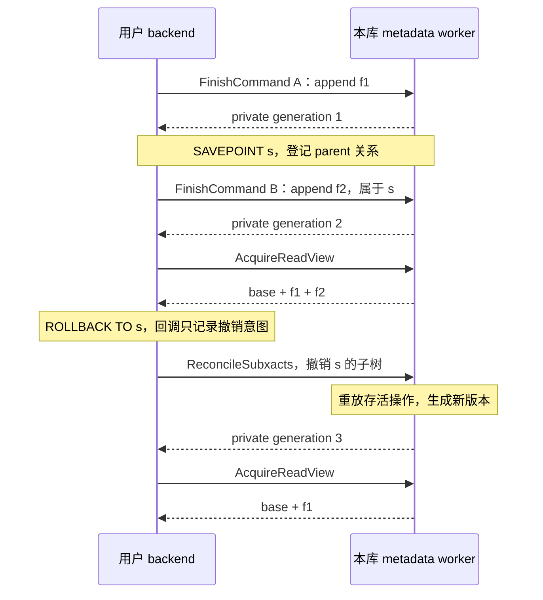
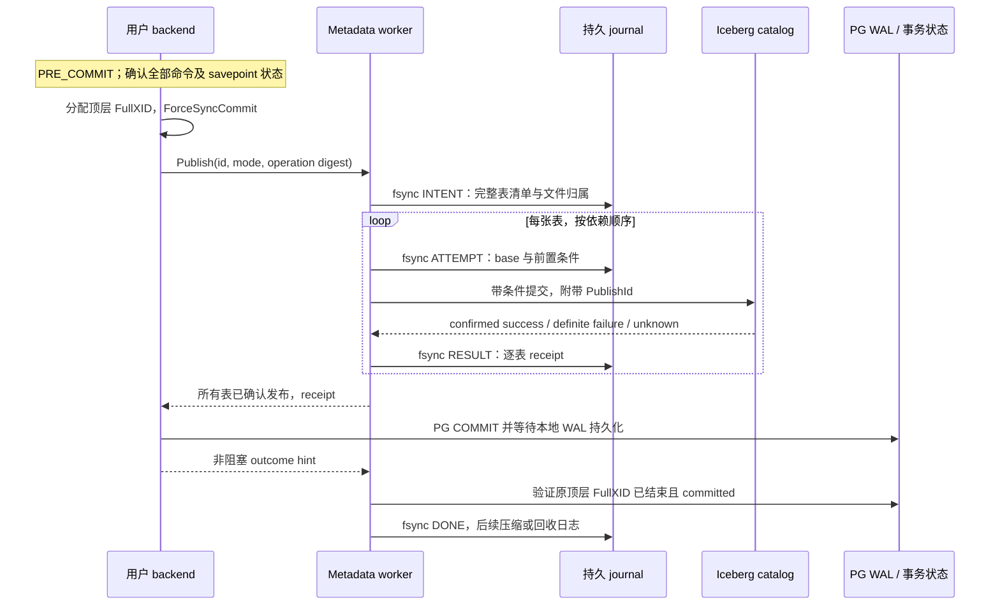
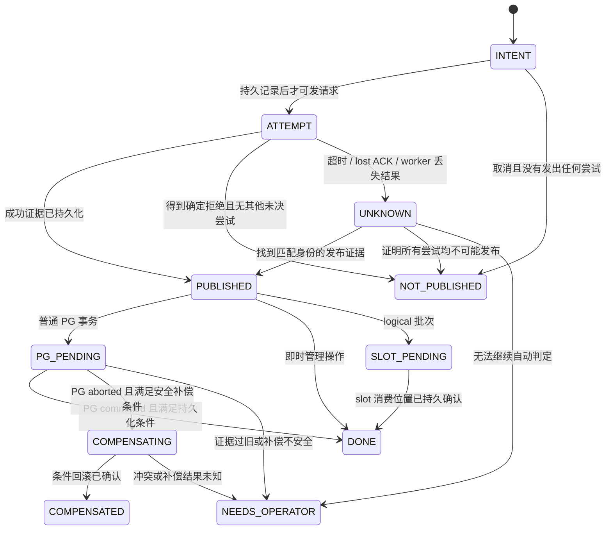

<!--
Licensed under the Apache License, Version 2.0 (the "License");
you may not use this file except in compliance with the License.
You may obtain a copy of the License at

    http://www.apache.org/licenses/LICENSE-2.0

Unless required by applicable law or agreed to in writing, software
distributed under the License is distributed on an "AS IS" BASIS,
WITHOUT WARRANTIES OR CONDITIONS OF ANY KIND, either express or implied.
See the License for the specific language governing permissions and
limitations under the License.
-->

# 每库元数据 worker：事务、通信与恢复协议

状态：后续事务迁移设计，尚未实施。基于 `4e60434` 和 iceberg-cpp 0.4.0。
[第 1 阶段](../metadata-workers.md) 只实现进程管理及 ping/echo 通道，
尚不实现本文的事务消息、持久化或恢复协议。
配套 [架构设计](metadata-backend.md)；[现有提交契约](postgres-iceberg-commit.md)
描述当前实现，本文描述拟迁移的行为与明确提出的改进。

## 1. 约束与发布类型

以下约束优先于吞吐优化：

1. 客户端只能写数据/delete 文件和提交写入材料；所有 Iceberg metadata 读写由本库
   worker 完成。客户端不持有可更新的 catalog Table 或 Iceberg Transaction。
2. 私有修改只属于一个 PG 顶层事务。已发放的 read view 不可变，不能引用随后继续
   修改的 transaction metadata；须持有不可变版本或受控深拷贝。
3. 所有有副作用的操作带稳定身份。超时、断连和进程退出都不能单独证明未发布。
4. Publish 发出前持久化意图；报告成功前持久化结果。状态不明确时不删可能被引用的文件。
5. PG COMMIT/ABORT 与子事务回调不能等待网络或队列空间。清理最终由服务完成。
6. 本库同表发布串行，跨库和跨引擎并发依靠 catalog 前置条件；不承诺跨系统原子提交。

不能把所有元数据更新都绑定到用户 PG 事务的最终结果：

| `publish_mode` | 入口与发布点 | PG 随后 abort 时的策略 |
| --- | --- | --- |
| `PG_TRANSACTION` | FDW/Table AM DML、Table AM 暂存 DDL；顶层 PRE_COMMIT 发布 | 未发布则清理；已发布按证据尝试安全补偿，不能补偿则保留待修复 |
| `IMMEDIATE_ADMIN` | 现有即时 create/register/schema/rollback 等 SQL 管理函数；函数调用中发布 | 保留已确认的外部效果，不因后续 PG abort 自动撤销；未知则查询 receipt |
| `LOGICAL_BATCH` | logical mirror 的显式 Flush；推进 slot 前发布 | 保留已发布批次，按批次去重后继续推进 slot，禁止套用普通事务的自动回滚 |

前两类保留现有操作的时机与非原子边界。第三类是本次设计要求显式区分的恢复策略：
目标表批次的持久成功不能依赖 mirror worker 本地 PG 事务最终是否提交，否则可能
回滚已经消费过 source WAL 的数据。mirror 的已知批次不得由通用 PG-abort 修复路径撤销。

## 2. 身份与服务端对象

| 对象 | 身份及生命周期 |
| --- | --- |
| `DatabaseIdentity` | PG system identifier、database OID、扩展安装 UUID；防止同名重建误认日志 |
| `SessionId` | database identity、PG 进程槽、连接 generation；不使用裸 PID |
| `TxnId` | session、客户端事务 nonce；第一次写入关联顶层 FullXID，不取 worker 的 XID |
| `StatementId` / `CommandId` | 客户端单调执行序号及命令可见性边界；嵌套 SPI 有父执行标识 |
| `SubxactId` | 顶层事务内的子事务 ID 与 parent；服务维护祖先关系和回滚 tombstone |
| `TableKey` | catalog/tenant 的实际身份、table UUID；建表前以 namespace/name 占位，目标 ref 属于操作参数 |
| `ReadViewId` | 表身份、完整 metadata version、私有 generation、所有者及 worker epoch |
| `OperationId` | TxnId、operation sequence；请求体摘要参与去重验证 |
| `PublishId` | 随机不可复用的持久身份、publish mode、表清单和内容摘要；跨 worker epoch 有效 |
| `FileToken` | Publish/Txn 归属、唯一文件 URI、文件种类、授权 binding、分配 generation |

扩展安装 UUID 是新增元数据，随扩展安装生成并持久保存；旧日志须显式迁移。
同一表的不同 ref 共用发布队列，避免把表级 schema/properties 修改误当作分支内独立操作。
本地启动代次不能代替数据库身份；PG system identifier 也不构成跨主机 leader fencing。
复制集群或 HA 接管不在本协议的自动恢复范围。

服务对象分为三个层次：

- `CatalogStore`：按授权范围复用客户端，按不可变版本缓存 metadata/manifests。
- `TxnContext`：base table、逻辑 operation 列表、命令状态、子事务树、文件集合和私有版本。
- `PublishRecord`：持久意图与逐表 receipt；即使原 Session/TxnContext 消失也继续存在。

同一顶层 PG 事务的 DML 与 Table AM DDL 共用一个事务适配器和 operation 序列。
迁移后不再依赖现有 engine 与 Table AM 两套 PRE_COMMIT 回调的注册顺序。
不同发布模式不能共用一个 PublishRecord；同一 PG 事务内已存在即时外部效果时，错误
信息应同时给出对应 PublishId，不能把它描述成全部已撤销。

## 3. 读视图与命令边界

| 情况 | 获取视图的规则 |
| --- | --- |
| 规划期 | 只取得估算和 schema 描述；执行开始重新验证，不把 cached plan 当执行快照 |
| 本事务尚未写此表 | 每个执行语句第一次访问时验证外部 head，同表别名和重复扫描共享该版本 |
| 本事务已写此表 | 使用首次写入的 base + 已成功完成且未回滚的命令；不自动吸收外部新提交 |
| 显式历史 snapshot | 使用明确的历史视图，不叠加本事务私有改动 |
| 扫描 rescan / 游标继续 fetch | 复用原 read view，不因后续命令或外部提交换版本 |
| schema 改变导致旧计划无法绑定 | 按字段 ID 重绑；不兼容则报错，不能按同名列静默错配 |

`REPEATABLE READ`/`SERIALIZABLE` 沿用当前兼容契约，不新增 Iceberg 事务级 MVCC/SSI，
也不提供 PG 与 Iceberg 共同时间点的快照。上述规则是明确的 Iceberg 行为，不能当作
PostgreSQL 对普通 heap 表的隔离保证。[PostgreSQL 隔离级别](https://www.postgresql.org/docs/18/transaction-iso.html)

客户端建立执行上下文后，在首次 Iceberg 访问时懒创建 `StatementId`。它不能只由
query 文本、prepared statement 名称或 PG command counter 单独确定。嵌套 SPI、触发器、
数据修改 CTE 必须映射到 PG 实际命令可见性边界；同一命令中的 UPDATE 扫描不能看到
自己正在追加的文件并再次更新这些行。

写入分为 `StageChange` 和 `FinishCommand`：前者暂存材料，后者在该命令完成并允许
后续命令看到效果时，原子推进 private generation。`RETURNING` 仍来自本地执行结果，
不通过重新扫描私有表实现。已有扫描保持旧 generation；它们引用的文件也继续 pin。
嵌套执行可以完成子命令并对后续合法命令可见，但父命令失败时按其子事务归属撤销。

这是要通过执行器原型验证的契约，不假设只添加一个 ExecutorEnd hook 就能覆盖所有
路径。任何尚未正确处理的嵌套写路径应在发生文件写入前明确拒绝，而非错误推进视图。
普通只读嵌套查询仍共享对应执行快照。WITH HOLD 游标不得持有已结束事务的私有 handle；
应完成 PG 自身的物化过程并释放 handle。

## 4. 写入、SAVEPOINT 与客户端失联

正常命令按以下顺序执行：

1. 客户端分配自己的顶层 FullXID；`BeginWrite` 检查授权、目标身份和读版本，固定该表 base。
2. `AllocateFiles` 批量登记唯一路径并持久化归属，返回 token 后客户端才能写文件。
3. 客户端写入并 Close 文件；发送 `StageChange`，包含 token、完整文件描述、读版本
   和操作验证条件。服务验证路径/格式/schema/spec/字段 ID，不能接受任意待删除 URI。
4. worker 在隔离的候选 transaction 上应用改动。全部成功才替换候选版本；失败不留下
   部分 mutation。物理文件写完、Stage 成功均不表示对其他 PG 事务可见。
5. `FinishCommand` 核对该命令的 operation 集合与摘要，推进私有 generation。
   未结束命令禁止进入最终 Publish；同一消息重复发送返回同一 generation。

Stage 去重仅保证当前 worker epoch 内的私有操作不重复应用。worker 丢失 volatile
状态后，原 PG 写事务必须失败；重发旧 Stage 不能自动重建一个新的事务。
已持久化的 PublishId 则独立恢复，不随 epoch 丢弃。



generation 永不回退或复用，generation 3 可以与 generation 1 数据相同，但身份不同。
`RELEASE SAVEPOINT` 将操作归属提升到 parent；回滚移除该节点及其后代，包括已提升
到该节点的操作。回滚到保存点后继续执行的新子事务使用新节点。

子事务回调不直接做同步 RPC，也不执行文件删除。客户端在顶层事务内保留控制事件，
通过预留共享控制槽发布递增的 cleanup generation。下一次普通请求先携带存活子事务
状态并等待 `ReconcileSubxacts`，服务确认后才能读、写或 Publish。撤销事件不能被
被撤销子事务的 MemoryContext 一起释放。

如果无法记录完整的撤销状态，设置不可清除的 transaction-poisoned 标志，禁止后续
Iceberg 操作及该事务的最终提交。不能丢掉一次 abort 通知后继续使用旧私有视图。
服务对旧子事务设置 tombstone；迟到的 Stage 或后台 job 完成事件不能重新加入修改。
前台退出后，服务按会话 generation 和 PG 状态失效事务，保留可能已发布的记录。

## 5. 普通 PG 事务发布时序



客户端只有在所有计划操作均有 durable success receipt 后才返回 PRE_COMMIT 成功。
部分成功、unknown 或未完成命令都不能被当成成功。多表依赖图按稳定顺序执行，遇到
第一个 definite failure/unknown 后停止尚未发出的发布；已经发出的请求需先收敛状态。
同一 PG 事务内先不并行发布多张表，以缩小不确定结果集合。

`ForceSyncCommit()` 在连接端执行，不能由 worker 对自身事务调用来替代。客户端提交
请求声明已设置该标志，服务把它持久记录。旧版本日志或缺少标志的记录不能直接套用
新日志的回收条件。ForceSyncCommit 只解决本地异步提交窗口，不解决 Iceberg 先可见、
其他 PRE_COMMIT hook 失败、远端请求未知或主备接管。
[PG 提交实现](https://github.com/postgres/postgres/blob/REL_18_STABLE/src/backend/access/transam/xact.c)

COMMIT/ABORT 回调只做有界、不抛错的本地标记和唤醒。后台根据真实 PG 状态完成处理；
通知丢失不影响正确性。未实现持久 prepared 协议前，仍拒绝有未决 Iceberg 事务的
`PREPARE TRANSACTION`，包括已有外部发布但尚未结清的普通事务。

## 6. 发布状态机与 journal

将运行中的事务状态和持久发布状态分开。TxnContext 在 `ACTIVE` 接收命令，在
`FROZEN` 拒绝新改动，随后关联 PublishRecord；worker 重启可以丢弃前两者，但不能
丢弃已经持久化的发布记录。丢失私有状态使原事务失败，不让它以空事务继续 COMMIT。



图描述单个发布步骤；多表记录保存每一步状态，不能以一个 success 布尔值覆盖部分
成功。尚未发布的后续步骤不会因为前一步 unknown 自动重试。`WAITING_FOR_BINDING`
是可恢复的阻塞原因，保留原步骤状态；它不是未发布证据。

journal 建议按以下路径分库保存，独立于用户 PG 事务：

```text
$PGDATA/pg_iceberg/metadata/<database-oid>/<installation-uuid>/
  records/<publish-id>.log
  allocations/<allocation-batch-id>.log
```

记录至少包含 format version、cluster/database identity、record sequence、长度/校验和、
PublishId、模式、原顶层 FullXID、session、操作摘要、表/步骤清单、base metadata location、
UUID/ref、尝试身份、预期提交标记、文件归属、结果证据及恢复动作。凭证只保存来源引用；
原始配置 URI 先拆分并去除敏感部分，不能假设 URI 总是不含密码。

分配记录先持久化再允许客户端写文件。第一次 catalog 请求前，完整意图及该次尝试
必须已经持久化；逐表结果持久化后才能确认对应成功；所有步骤完成后才能发总成功。
可以合并 fsync，但 ACK 屏障不能提前。文件创建/原子替换/删除要连同必要的目录 fsync
一起设计；磁盘满或 fsync 失败时停止新的发布，保留此前成功或 unknown 的条目。

重启时只接受完整校验的记录；不完整尾部不得被解释成成功或安全未发布。损坏记录隔离
为待检查，禁止据此 GC。老版本 recovery log 需要只读兼容或显式迁移，缺失身份和 WAL
保证的记录保守处理，不能自动升级为有完整证据的新 receipt。

普通事务恢复先确认顶层 FullXID 是否仍在有效历史范围内，再检查是否 in progress，
最后判断 committed/aborted。采用与 `pg_xact_status(xid8)` 相符的 epoch、截断锁和状态
检查规则；过旧返回 unknown，不拿低 32 位猜结果。
[PG xid8 状态查询实现](https://github.com/postgres/postgres/blob/REL_18_STABLE/src/backend/utils/adt/xid8funcs.c)

普通事务的 DONE 记录可在确认 PG 持久提交、无待清理文件且去重保留期结束后压缩。
保留期结束后，旧 PublishId 的未知查询返回 `RECEIPT_EXPIRED`，不能重新执行写入。
重试 Publish 必须匹配一个仍存在的 FROZEN TxnContext 或已有持久记录，绝不能把查不到
ID 理解为可以创建新发布。即时管理请求也需先登记持久身份，不能在重连时静默换 ID。

## 7. 取消、丢失响应与补偿

取消消息只表示用户不再等待，不证明底层 catalog 操作已经停止：

| 时点 | 服务动作 | 可向客户端报告的结论 |
| --- | --- | --- |
| Publish 尚未持久接受 | 关闭原会话的发送资格；正常 abort 清理暂存状态 | 当前请求未被接受；仍需避免迟到请求重新执行 |
| INTENT 已记录，尚无 ATTEMPT | 在同一调度序列中取消，持久记录未发布 | `NOT_PUBLISHED` |
| ATTEMPT 已发出 | 停止未开始步骤，继续收集已发请求结果 | `UNKNOWN` 或随后确认的结果 |
| 全部成功但客户端未收到 ACK | 保存 receipt，等待 PG 实际结果 | `PUBLISHED`，不再次执行 |
| worker 重启后只有 ATTEMPT | 检查外部证据、隔离原尝试 | 在证明前为 `UNKNOWN` |

“catalog head 仍等于 base”不一定证明未发布：远端仍可能处理旧请求。只有在得到明确
拒绝，或能证明所有旧尝试不会再生效且完成充分检查后，才能认定 `NOT_PUBLISHED`。
服务无法证明时保留 unknown；正向找到匹配的 PublishId/步骤 ID、table UUID 和版本
可以确认已发布。旧标记被覆盖、历史被清理、同名表被替换都不能作为未发布证据。

未知发布暂时阻止本库对该表启动新的写发布，其他表仍可工作。读请求可以访问 catalog
确认的当前版本，但不会承诺过滤掉来自尚未结束 PG 事务的 Iceberg snapshot。
跨库和外部 writer 不受本地队列约束，自动恢复必须允许外部版本继续前进。

客户端等待超时后可以查询原 PublishId；如果 PG 已经进入 aborted 状态，不能在原
事务中继续运行普通 SQL 来完成这个查询，应在新事务或由后台恢复。只有明确尚未失败
且仍处于同一次 PRE_COMMIT 等待流程时，才允许原调用重取结果。

自动补偿仅适用于 `PG_TRANSACTION`，并同时满足：

1. 原顶层 PG 事务确定已终止且 aborted，所有本地发布 job 已停止；不存在可能迟到的
   未决尝试。故障后的老 epoch 请求不会再被新 worker 执行。
2. table UUID 和完整 metadata version 与已记录结果相符，没有后继提交或其他属性变化。
3. 操作有经过验证的补偿方式，补偿使用 catalog 前置条件，失败不能覆盖并发更新。

第一版自动补偿限于可安全恢复到已知父 snapshot 的 DML；协议自身提交标记以外的 schema/properties 变化、
首次 snapshot、create/register/drop，以及无法证明条件的情况进入 `NEEDS_OPERATOR`。
补偿自身也带唯一 ID、durable intent 和 receipt；补偿响应丢失时不递归盲目重试。
回滚 head 不等于可以删除所有新文件：旧 snapshot/metadata 可能仍引用它们。

## 8. 文件所有权与清理

文件按 `ALLOCATED → WRITING → CLOSED → STAGED → MAY_BE_PUBLISHED → REFERENCED`
推进；另有 `GC_CANDIDATE` 与 `DELETED`。状态只是记录，删除还要检查证据。

| 文件类别/状态 | 谁负责 | 删除条件 |
| --- | --- | --- |
| 尚未交给服务登记的本地临时文件 | 写入 backend | 本地作用域结束后可清理，不得已提交给 Stage |
| 已分配 token 的新数据/delete 文件 | worker 记录归属，backend 写入 | 写入者已停止、未发布证据成立、无存活私有视图引用、保留期已过 |
| Stage/回滚重建生成的 manifest 等文件 | worker | 单独追踪；同时排除存活候选、read handle 和发布记录引用 |
| 可能已发布或已确认发布的文件 | worker 保留，后续由表维护处理 | 不走事务 abort 的直接 unlink，即使 head 已被补偿也一样 |
| 既有文件或外部 writer 创建的文件 | 表维护操作 | 不纳入本事务自有文件 GC |

从 `AllocateFiles` 返回 token 起，客户端不能因 Stage 超时、SQL abort 或析构自动 unlink
这些路径。现有 `NewDataFilesCleanupGuard`/`CleanupDataFiles` 需要改为协议通知，避免
客户端删除服务已接管的文件。失败时宁可暂留垃圾，也不能删除已经发布的数据。

删除前先等待相关写入 I/O 结束；超时租约本身不能让仍活着的 writer 失去文件后继续
写入同一路径。取消未确认时不 GC。对象存储 multipart upload 的终止与残片回收也计入
文件生命周期，不能只删除最终对象名称。

服务生成 metadata 文件时，需要跟踪 FileIO 的创建行为或取得上游生成文件清单。
若某类内部临时文件无法可靠追踪，先保留为后续 orphan 维护对象，不能通过猜测文件名
或扫描整个 warehouse 来补偿。分配 journal 允许批量登记，避免每写一行或一页 fsync。
已发布文件被外部引擎引用的情况，不能仅凭本服务无 handle 就判为垃圾。

## 9. RPC、排队与资源限制

每个客户端通过一对 DSM `shm_mq` 与本库 worker 通信。统一消息头包含协议版本、
长度、类型、database/session/worker generation、request ID、TxnId、命令/子事务 ID、
operation sequence、deadline 和 payload 摘要。响应包含原身份、结果、已应用序号、
view generation 或 PublishId。握手检查扩展构建和协议主版本，不兼容则在写入前拒绝。

线格式使用确定的整数字节序、长度前缀和版本化字段，不直接 memcpy C++ struct。
schema/expression 用明确的字段 ID 表示；partition scalar、decimal、binary、NaN/null
等值需要类型化编码和 round-trip 校验。未知必要字段拒绝，长度及嵌套深度在分配前验证。
大型 task 页与文件统计可分帧；业务请求只有在完整接收且摘要校验后才执行。

客户端将可能被 PG ERROR 中断的发送视为可损坏该连接队列：清理时标记旧 channel
detached，再使用新 channel 查询 durable status，不从半条旧消息继续发送。
同一 session 的可变操作按序处理，不能因异步 job 完成顺序改变命令顺序。读计划可以
并发，但只能引用已固定 view。跨 worker epoch 的旧 handle/Stage 一律拒绝。

| 请求类别 | 重试规则 |
| --- | --- |
| Describe / Acquire / Plan | 并未交付数据前可以重新请求；已开始扫描不得悄悄换 read view |
| FetchTasks | 带 page sequence/token；ACK 前保留有界重发页，避免 lost ACK 跳任务或重复读行 |
| Stage / Finish / Savepoint 控制 | 同 epoch 内按 operation ID + digest 去重；不同内容复用 ID 报错 |
| Publish | 原 ID 查询或返回已有结果；不能用新 ID 自动重放 |
| Release / outcome hint | 幂等、允许重复；丢失由所有权记录兜底 |

一条扫描的 task 流第一页、中间页和 EOF 都有序号；客户端只在整页纳入本地任务序列后
确认。旧页已被回收则明确报错，不以空页伪装 EOF。worker 重启后，只有已取得完整 tasks
并拥有完整本地 reader 上下文的扫描可能继续；依赖剩余流或丢失私有状态的事务失败。

共享控制槽与普通数据队列分离，预留 cancel/abort/worker 状态位置，避免响应队列满
时连取消都无法送达。主线程不阻塞发送大响应，使用可写事件或客户端轮询继续发送。
调度按客户端轮转，并分别限制 read-plan、publish、recovery job 数；同一 TableKey
只允许一个发布 job。恢复不能永久饿死正常请求，正常请求也不能耗尽恢复保留资源。

必须有可配置的字节上限：每库 metadata cache、私有事务、排队请求、每客户端消息、
未 ACK task 页，以及总 DSM 预算；还要有活跃句柄、写文件数、请求和 I/O deadline。
上限检查发生在接受工作之前；已经接受的 Publish 必须预留 journal 与结果处理资源。
碰到上限可以淘汰无 pin 缓存或拒绝新工作，不能丢弃未决发布记录。数值由原型压测定，
第一版不声称无界并发或固定性能收益。

结构化错误包含 SQLSTATE、稳定错误类别、可否在新事务重试、外部结果状态、PublishId
以及不含凭证的说明。建议映射：冲突 `40001`、权限 `42501`、不支持 `0A000`、取消
`57014`；unknown 额外携带 `external_outcome=unknown`，不得仅返回可自动重试的冲突码。
预期协议错误隔离到会话；journal/内存完整性错误停止服务接单，不能继续处理可能损坏的状态。
[SQLSTATE 名称与编号](https://www.postgresql.org/docs/18/errcodes-appendix.html)

## 10. DDL、配置和 logical 批次

DDL 与 DML 都进入本库 worker，但保留不同操作的时机。事务型 DDL 进入同一有序
operation 列表，建表前采用名称键并分配私有 UUID；不能把同名重建表认作原对象。
冻结 Publish 时按存活 operation 生成计划，折叠只发生在此阶段，不能破坏 SAVEPOINT
重建所需的原始顺序。建议支持矩阵如下：

| 同一普通事务内的操作 | 发布计划 |
| --- | --- |
| create | 使用 `Catalog::StageCreateTable` 创建私有事务，PRE_COMMIT 才发布 |
| create → insert/read | 使用新表私有 schema/metadata；将 append 合并进创建事务，一次发布含数据的新表 |
| create → drop | 抵消未发布的创建及其数据改动；不在 catalog 先创建再删除 |
| 已有表 write → drop | 放弃仅属本事务的 DML 发布，执行对原 UUID 的条件 drop；自有未发布文件进入 GC |
| drop → 同名 create | 第一版明确拒绝，避免引入不可原子完成的身份替换；列为兼容性限制 |
| Table AM ALTER TABLE | 保留现有不支持行为；不借本次重构扩大 DDL 范围 |

0.4.0 的公开 `Catalog::StageCreateTable` 已提供创建事务入口，可作为新表私有读写的
实现基础；具体 catalog 适配器不支持时，在写数据文件前拒绝该组合。
另一个必须补齐的能力是条件删除：0.4.0 的 `Catalog::DropTable(identifier, purge)`
没有 expected UUID/version 参数，SQL catalog 实现也按名称删除。先 LoadTable 检查再
DropTable 存在竞态，不能声称已经实现条件 drop。需要上游或适配层提供原子身份/版本
检查；能力未具备时拒绝要求该保证的删除，而非在重试时可能删掉同名新表。
服务第一版不执行 purge；文件清理独立于 catalog 名称删除。create/register/drop
响应未知都先查询身份与 receipt，不将“按名操作可重复调用”当成正确的幂等协议。

即时管理请求独立登记 PublishId，并在同表队列中执行；如果同一 PG 事务已经对此表
有待发布 DML，第一版拒绝插入即时 DDL，避免私有 base 与即时外部修改互相覆盖。
这种混用限制应作为明确的兼容性变化发布，不能无声丢弃暂存改动。跨事务管理操作
则仍走并发检查，必要时使旧写事务产生冲突。

配置和 ACL 仍以调用者 PG 事务可见的内容为准。每次新命令重新验证权限与绑定指纹，
role 切换后不得复用原授权 token。worker 的 SPI 查询用于重启恢复和加载已提交配置，
不能等待客户端正在修改但未提交的配置行锁。临时配置进入原 TxnContext，事务结束后
不会自动提升为全局配置；应重新从已提交配置表验证。直接 UPDATE 配置表也必须导致
后续命令绑定指纹变化，不能只依赖管理函数发出的缓存失效通知。

logical 批次需有独立的持久身份：mirror UUID、source/slot incarnation、确定的 WAL
范围、批次内容摘要与目标表身份。slot 被重建不能复用旧 incarnation。第一版沿用
已有 INSERT-only 能力，不在此重构中加入 UPDATE/DELETE 复制。

1. 冻结批次范围并记录 intent，然后生成文件；丢失 ACK 后仍查询同一 PublishId。
2. 将 append 与批次标记原子发布到目标表，等待 durable receipt。
3. 确认成功后推进 slot；若在此前崩溃，按相同范围重读，先检查 receipt/目标标记，
   已发布则只推进 slot，不重复 append。
4. 若推进 slot 后、更新本地 mirror 进度前崩溃，以实际 slot 状态与持久批次记录修复
   进度；不得因为 worker 的 PG 事务 aborted 而撤销目标批次。
5. slot 的内存进度不等于可删除所有去重证据。目标端保留按 mirror/source incarnation
   区分的已应用进度或可证明的批次记录，直至超过 slot 崩溃重放可能覆盖的范围。

PostgreSQL 文档说明 logical slot 在崩溃后可能从较早位置重新发送，消费端需要处理
重复消息；因此这里的去重保留条件不能仅是一次 slot advance 已返回。
[Logical decoding 与 slot 持久化](https://www.postgresql.org/docs/18/logicaldecoding-explanation.html)

必须验证当前 LastBatchId 机制在重新分批、多个 mirror 共用目标表、slot 进度回退时
是否充分；只有最后一个批次 ID 不能被当作任意历史的完整去重日志。该验证是迁移门槛，
不能用“用了同一个元数据 worker”推导出 exactly-once。

## 11. 故障注入与实现验收

| 场景 | 必须观察到的结果 |
| --- | --- |
| Stage 成功但 ACK 丢失 | 同 epoch 重试不重复添加文件，摘要不符报错 |
| 同语句 UPDATE / INSERT SELECT | 固定旧读视图，不重复扫描自己新写入的行 |
| 两层 SAVEPOINT，release 后回滚父层 | 所有归属后代的改动撤销，旧扫描版本不原地改变 |
| 子事务回滚与 Stage job 完成竞态 | tombstone 阻止迟到修改复活；下一次读取等待 reconcile |
| worker 重启，原写事务仍存活 | 私有状态丢失使事务失败，不能 COMMIT 空修改 |
| INTENT 持久化前/后崩溃 | catalog 无未记录尝试；分配文件可定位或保守保留 |
| catalog 成功、RESULT fsync/ACK 前崩溃 | 找到证据后标记 published；不重复写入、不误删文件 |
| 两表提交，第二表拒绝或 unknown | 原 PG 事务失败，第一表单独恢复，unknown 表保留文件 |
| PG COMMIT 后丢失通知 | 同步提交标志与 FullXID 检查允许后台结清；不回滚成功事务 |
| FullXID 过旧、配置回滚、凭证过期 | 明确保留 unknown/等待绑定，不猜测 PG 或 Iceberg 结果 |
| 外部 writer 在补偿前更新 metadata | 前置条件阻止覆盖，进入人工处理 |
| mirror 发布后、slot 推进前/后崩溃 | 不重复 append，不因本地 PG abort 撤销已发布批次 |
| 同表跨库并发、不同授权别名 | catalog 验证仍生效，不泄漏缓存权限，不丢更新 |
| 队列满、慢客户端、取消、journal 磁盘满 | 内存有界，控制消息可达，停止新增发布，既有结果保留 |
| 停用服务、强制删库、同名重建 | 无双 worker；旧日志不被新库认领，不自动删除外部数据 |

验证顺序为：纯协议/描述符 round-trip → PG 16/17/18 生命周期与命令回调原型 →
现有 SQL 回归 → 两连接与跨库并发 → catalog 故障注入 → 容量和性能。
原型证据不足的部分保留为明确门槛，不在实现中静默降级为不安全行为。

建议按可独立评审的变更拆分：launcher 与只读 RPC；全部元数据读取迁移；统一事务适配
及私有视图；持久 Publish 与文件归属；DDL/mirror 迁移；故障注入和性能基线。
任一中间阶段均不代表全量元数据集中已完成。共享 Arrow 缓冲另立后续变更。
